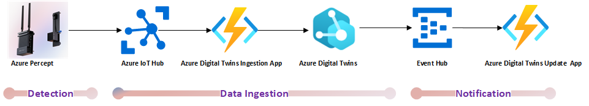
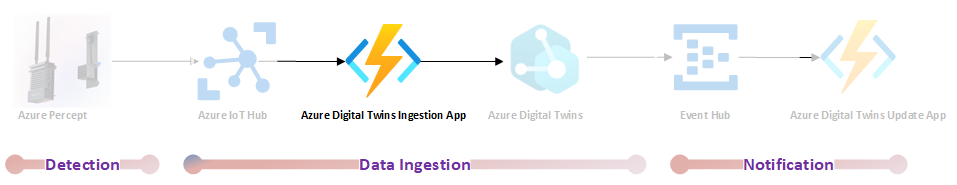
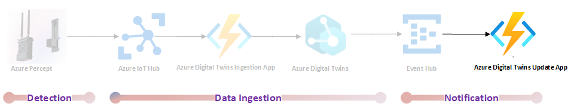

# Azure Percept with Azure Digital twins

## Overview

Imagine that you represent a company that manages facilities for various conferences and exhibitions. Part of your job is to ensure that products exhibited by participants ( or customers) are being displayed at right location assigned to the participant. For that what you need is a view of the facilities but at the same time real time intelligence on the products that are being exhibited.

## Architecture



## Prerequisites

- Azure Subcription
- Admin Access to Azure AD Tenant & Azure Subscription
- Mac OS: [PowerShell for Mac](https://docs.microsoft.com/en-us/powershell/scripting/install/installing-powershell-core-on-macos?view=powershell-6 )
- Windows OS: PowerShell is built-in
- 

## Setup

### Azure Percept Setup

#### Data coming from Azure Percept

```json
{
  "body": {
    "NEURAL_NETWORK": [
      {
        "bbox": [
          0.32,
          0.084,
          0.636,
          1
        ],
        "label": "person",
        "confidence": "0.889648",
        "timestamp": "1622658821393258467"
      }
    ]
  },
  "enqueuedTime": "2021-06-02T18:33:41.866Z"
}
```

### Azure Digital Twin Setup

Azure Digital Twin setup is divided into two distinct parts. The first part is the Azure Digital Twin Instance setup which is common for any Azure Digital Twin setup. The second part deals with the set up of model. This will be different for each case. In our case we would need to have a model that have two components. One component of the model will be the site where the exhibition is taking place. The second component is of the model is floor which is assigned to a particular exhibition participant.

#### Azure Digital Twin Instance Setup

```powershell

$rgname = "<your-prefix>"
$random = "<your-prefix>" + $(get-random -maximum 10000)
$dtname = $random + "-digitaltwin"
$location = "westus2"
$username = "<your-username>@<your-domain>"
$functionstorage = $random + "storage"
$telemetryfunctionname = $random + "-telemetryfunction"
$twinupdatefunctionname = $random + "-twinupdatefunction"

# Create resource group
az group create -n $rgname -l $location

# Create Azure Digital Twin instance
az dt create --dt-name $dtname -g $rgname -l $location

# Create role assignment for user needed to access Azure Digital Twin instance
az dt role-assignment create -n $dtname -g $rgname --role "Azure Digital Twins Data Owner" --assignee $username -o json

```

#### Model Setup

``` PowerShell

$sitemodelid = "dtmi:percept:DigitalTwins:Site;1"

# Creating Azure Digital Twin model for Site
az dt model delete --dt-name $dtname --dtmi $sitemodelid
$sitemodelid = $(az dt model create -n $dtname --models .\SiteInterface.json --query [].id -o tsv)

$sitefloormodelid = "dtmi:percept:DigitalTwins:SiteFloor;1"

# Creating Azure Digital Twin model for Site floor
$sitefloormodelid = $(az dt model create -n $dtname --models .\SiteFloorInterface.json --query [].id -o tsv)

# Creating twin: PerceptSite
az dt twin create -n $dtname --dtmi $sitemodelid --twin-id "PerceptSite"

# Creating twin: PerceptSiteFloor
az dt twin create -n $dtname --dtmi $sitefloormodelid --twin-id "PerceptSiteFloor"

$relname = "rel_has_floors"

# Creating relationships"
az dt twin relationship create -n $dtname --relationship $relname --twin-id "PerceptSite" --target "PerceptSiteFloor" --relationship-id "Site has floors"

```
Here is how the model will look like once it is created on Azure Digital Twin using the above mentioned commands.


### Functions Apps Setup

#### Twins Ingestion App




```csharp
namespace TwinIngestionFunctionApp
{
    using Azure;
    using Azure.Core.Pipeline;
    using Azure.DigitalTwins.Core;
    using Azure.Identity;
    using Microsoft.Azure.EventHubs;
    using Microsoft.Azure.WebJobs;
    using Microsoft.Extensions.Logging;
    using Newtonsoft.Json;
    using Newtonsoft.Json.Linq;
    using System;
    using System.Net.Http;
    using System.Text;
    using IoTHubTrigger = Microsoft.Azure.WebJobs.EventHubTriggerAttribute;

    public class TwinsFunction
    {
        private static readonly string adtInstanceUrl = Environment.GetEnvironmentVariable("ADT_SERVICE_URL");
        private static HttpClient httpClient = new HttpClient();

        [FunctionName("TwinsFunction")]
        public async void Run([IoTHubTrigger("messages/events", Connection = "EventHubConnectionString")] EventData message, ILogger log)
        {

            if (adtInstanceUrl == null) log.LogError("Application setting \"ADT_SERVICE_URL\" not set");
            {
                try
                {
                    //Authenticate with Digital Twins
                    ManagedIdentityCredential cred = new ManagedIdentityCredential("https://digitaltwins.azure.net");
                    DigitalTwinsClient client = new DigitalTwinsClient(new Uri(adtInstanceUrl), cred, new DigitalTwinsClientOptions { Transport = new HttpClientTransport(httpClient) });
                    if (message != null && message.Body != null)
                    {
                        log.LogInformation(Encoding.UTF8.GetString(message.Body.Array));

                        // Reading AI data for IoT Hub JSON
                        JObject deviceMessage = (JObject)JsonConvert.DeserializeObject(Encoding.UTF8.GetString(message.Body.Array));
                        string label = deviceMessage["NEURAL_NETWORK"][0]["label"].ToString();
                        string confidence = deviceMessage["NEURAL_NETWORK"][0]["confidence"].ToString();
                        string timestamp = deviceMessage["NEURAL_NETWORK"][0]["timestamp"].ToString();
                        if(!(string.IsNullOrEmpty(label) && string.IsNullOrEmpty(confidence) && string.IsNullOrEmpty(timestamp)))
                        {
                            var updateTwinData = new JsonPatchDocument();
                            updateTwinData.AppendAdd("/Label", label);
                            updateTwinData.AppendAdd("/Confidence", confidence);
                            updateTwinData.AppendAdd("/timestamp", timestamp);
                            await client.UpdateDigitalTwinAsync("PerceptSiteFloor", updateTwinData);
                            log.LogInformation($"Updated Device: PerceptSiteFloor with { updateTwinData} at: {DateTime.Now.ToString()}");
                        }
                    }
                }
                catch (Exception e)
                {
                    log.LogError(e.Message);
                }

            }
        }
    }
}
```

Details mentioned at: [TwinsIngestionFunctionApp](https://github.com/nabeelmsft/percept/tree/main/adt/apps/TwinIngestionFunctionApp)

#### Setting up Azure Digital Twin to push messages to Event Hub

1. Create EventHub Namespace
1. Create event hub
1. Create event hub route
1. Update Azure Digital Twin to route message to event hub


#### Twins Update App


