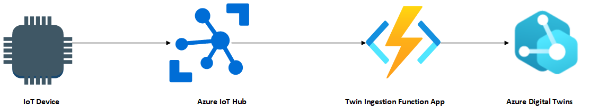
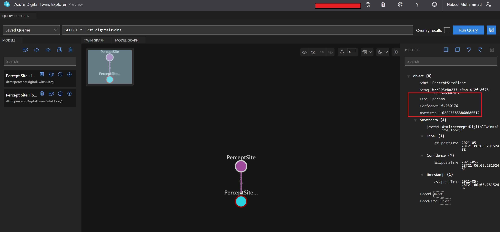

# Consuming device data from Azure IoT Hub by Azure Digital Twins

## Overview

In this post we will see how easy it is to consume device data from Azure IoT Hub by Azure Digital Twins.

## Data Flow



## Prerequisites

- Azure Subcription
- Admin Access to Azure AD Tenant & Azure Subscription
- Mac OS: [PowerShell for Mac](https://docs.microsoft.com/en-us/powershell/scripting/install/installing-powershell-core-on-macos?view=powershell-6 )
- Windows OS: PowerShell is built-in
- Azure Digital Twin Instance. Get host address of Azure Digital Twin instance's as ADT_SERVICE_URL App setting for the Azure Function App.
- Device connected to Azure IoT Hub. Get the Event Hub-compatible endpoint from the Built-in endpoints from the Azure IoT Hub.


## Connecting Azure IoT Hub with Azure Digital Twin

### Function code

```csharp
namespace TwinIngestionFunctionApp
{
    using Azure;
    using Azure.Core.Pipeline;
    using Azure.DigitalTwins.Core;
    using Azure.Identity;
    using Microsoft.Azure.EventHubs;
    using Microsoft.Azure.WebJobs;
    using Microsoft.Extensions.Logging;
    using Newtonsoft.Json;
    using Newtonsoft.Json.Linq;
    using System;
    using System.Net.Http;
    using System.Text;
    using IoTHubTrigger = Microsoft.Azure.WebJobs.EventHubTriggerAttribute;

    public class TwinsFunction
    {
        private static readonly string adtInstanceUrl = Environment.GetEnvironmentVariable("ADT_SERVICE_URL");
        private static HttpClient httpClient = new HttpClient();

        [FunctionName("TwinsFunction")]
        public async void Run([IoTHubTrigger("messages/events", Connection = "EventHubConnectionString")] EventData message, ILogger log)
        {

            if (adtInstanceUrl == null) log.LogError("Application setting \"ADT_SERVICE_URL\" not set");
            {
                try
                {
                    //Authenticate with Digital Twins
                    ManagedIdentityCredential cred = new ManagedIdentityCredential("https://digitaltwins.azure.net");
                    DigitalTwinsClient client = new DigitalTwinsClient(new Uri(adtInstanceUrl), cred, new DigitalTwinsClientOptions { Transport = new HttpClientTransport(httpClient) });
                    //log.LogInformation($"ADT service client connection created.");
                    if (message != null && message.Body != null)
                    {
                        log.LogInformation(Encoding.UTF8.GetString(message.Body.Array));

                        // Reading AI data for IoT Hub JSON
                        JObject deviceMessage = (JObject)JsonConvert.DeserializeObject(Encoding.UTF8.GetString(message.Body.Array));
                        string label = deviceMessage["NEURAL_NETWORK"][0]["label"].ToString();
                        string confidence = deviceMessage["NEURAL_NETWORK"][0]["confidence"].ToString();
                        string timestamp = deviceMessage["NEURAL_NETWORK"][0]["timestamp"].ToString();
                        if(!(string.IsNullOrEmpty(label) && string.IsNullOrEmpty(confidence) && string.IsNullOrEmpty(timestamp)))
                        {
                            var updateTwinData = new JsonPatchDocument();
                            updateTwinData.AppendAdd("/Label", label);
                            updateTwinData.AppendAdd("/Confidence", confidence);
                            updateTwinData.AppendAdd("/timestamp", timestamp);
                            await client.UpdateDigitalTwinAsync("PerceptSiteFloor", updateTwinData);
                            log.LogInformation($"Updated Device: PerceptSiteFloor with { updateTwinData} at: {DateTime.Now.ToString()}");
                        }
                    }
                }
                catch (Exception e)
                {
                    log.LogError(e.Message);
                }

            }
        }
    }
}
```

Here is how data looks like on Azure Digital Twin Explore:



## Conclusion

Using Azure.DigitalTwins.Core library we can create data flow pipeline to Azure Digital Twin.