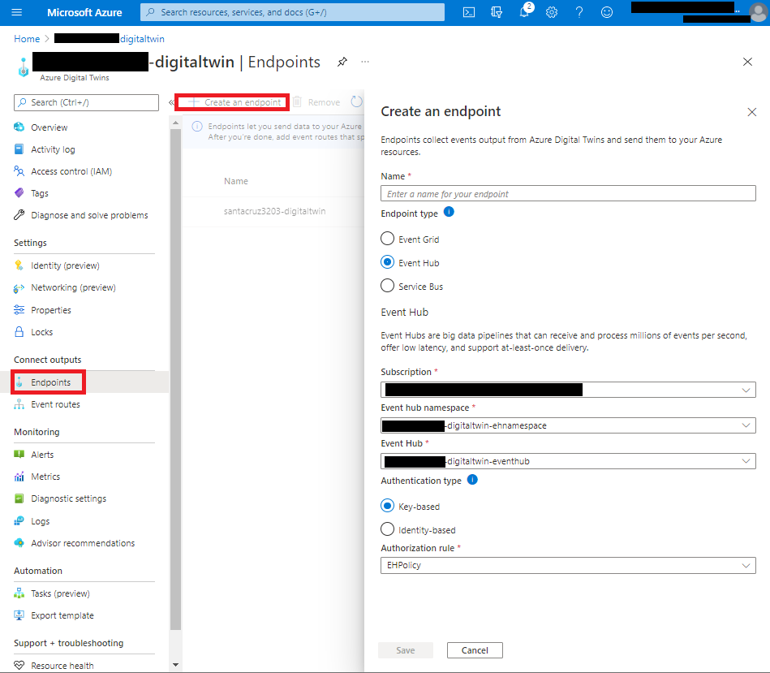

# Consuming Azure Digital Twins data updates using Event Hub and new Azure Function Extension Libraries (Beta)

## Overview

The beta version for Storage, Event Hubs, Service Bus, and Event Grid Functions extensions make it possible to use secretless configuration via Azure Active Directory. Azure SDKs are adding capabilities enabling users to leverage Azure Cloud as platform to the fullest. Secretless configuration is one of the Azure platform capabilities that eliminate the responsibility of managing and maintaining secrets for various services. Leveraging secretless configuration capability reminds of using gravity to your advantage. You can use configuration that has secrets but that brings the responsibility to maintain and manage secrets in picture. Like gravity, it is good to leverage native platform capability of Azure. Now with Azure SDK's Azure Function Extension Libraries (Beta) we can build truly secretless systems.

In this post we will see how easy it is to consume Azure Digital Twins data using secretless Azure Function through Azure Event Hubs. Once the Azure Digital Twins is set up for getting data from IoT devices through Azure IoT Hub, the flow is to read that data in form of Azure Digital Twins graph representation. This post addresses how to read Azure Digital Twins data for the down stream systems using secretless configuration feature of Azure Function Extension Libraries(Beta).

Here is what we are going to do:

1. Set up Azure Digital Twins to route events to event hub
2. Set up Azure Function App to process Event Hub Trigger
3. Add code to Azure Function App

## Data Flow


## Prerequisites

- Azure Subcription
- Admin Access to Azure AD Tenant & Azure Subscription
- Mac OS: [PowerShell for Mac](https://docs.microsoft.com/en-us/powershell/scripting/install/installing-powershell-core-on-macos?view=powershell-6 )
- Windows OS: PowerShell is built-in
- Azure Digital Twins Instance. The assumption is that the Azure Digital Twins is getting data from IoT device through Azure IoT Hub. For details how you can set up Azure Digital Twins with Azure IoTHub visit [Azure Digital Twins update](https://github.com/nabeelmsft/percept/tree/main/adt/apps/TwinIngestionFunctionApp).
- Azure Event Hub instance. For details on how to create Azure Event Hub visit [Create an event hub using Azure portal](https://docs.microsoft.com/azure/event-hubs/event-hubs-create). Make sure to retrieve the fully qualified namespace for the event hub. We will be using that in subsequent sections.
- Azure Function App. This will be designated app that will run with any secrets using secretless configuration. In this post we will configure this Azure Function App to enable secretless configuration.

## Set up Azure Digital Twins to route events to event hub

Routing events from Azure Digital Twins to Azure Event hub is a simple two step process.

### Create Azure Digital Twins Endpoint

Following image illustrates how to create azure Digital Twins Endpoint:



### Create Azure Digital Twins Event Route

Following image illustrates how to create Azure Digital Twins Event Route:


## Set up Azure Function App to process Event Hub Trigger

For using secretless configuration requires certain configurations for Azure Function. Following are the configurations that will enable secretless configuration.

### Enabled Managed Identity for the Function App

To enable secretless configuration we will use Azure Active Directory to authenticate Azure Function App. The first step in this process is to enable Managed Identity for the function app. 

Here are the steps:

1. Login to [Azure Portal](https://portal.azure.com/) and navigate to your Azure Funcation App that was mentioned in the prerequisite section.
2. On the left navigation menu click "Identity".
3. On the "System assigned" tab, select "On" toggle button under "Status" heading.
4. Click "Save".

Following image illustrates the steps:


### Add application setting for EventHub connection

When we use Azure Function to listen to EventHub triggers, we add EventHubConnection as an application setting. Here is an example of such EventHubConnection setting:

```json
"EventHubConnection": "Endpoint=sb://santacruz3203-digitaltwin-ehnamespace.servicebus.windows.net/;SharedAccessKeyName=EHPolicy;SharedAccessKey=Your-Shared-Access-Key=;EntityPath=santacruz3203-digitaltwin-eventhub"
```

You can see in above image, secret is included as part of the EventHubConnection setting.

The secretless configuration takes away the use of secrets in the configuration. So the above mentioned connection string will now look like the following when using secretless configuration:

```json
"EventHubConnection__fullyQualifiedNamespace": "santacruz3203-digitaltwin-ehnamespace.servicebus.windows.net"
```

There are two things worth noting from the above configuration setting:

1. There is no secret mentioned in the Application Setting for EventHubConnection.
2. Addition of "__fullyQualifiedNamespace" as part Application setting name. This is how the beta version for Storage, Event Hubs, Service Bus, and Event Grid Functions extensions know to use secretless configuration.

Here are the steps to accomplish this:

1. Login to [Azure Portal](https://portal.azure.com/) and navigate to Azure Function App that was mentioned in the prerequisite section.
2. On the left navigation menu click "Configuration".
3. On the "Application settings" tab, click "+ New application setting" button under "Application settings" heading.
4. Add "EventHubConnection__fullyQualifiedNamespace" as application setting name.
5. Add fully qualified namespace as application setting value.
You can retrieve fully qualified namespace by opening Event Hub Namespace on Azure Portal and retrieving the given for "Host name" as shown below:


6. Click "OK".
7. Click "Save".

Following image illustrates the above mentioned steps:


### Add role assignment for Azure Function in Event Hub instance

The final part of the Azure Function configuration is enabling managed identity for Azure Function in EventHub.

Here are the steps:

1. Login to [Azure Portal](https://portal.azure.com/) and navigate to the EventHub that was mentioned in the prerequisite section. This will open EventHub instance blade.
2. On the left navigation menu click "Access control (IAM)".
3. Click "+ Add".
4. Choose "Add role assignment".
5. On the "Add role assignment" panel, select:
    1. "Azure Event Hubs Data Receiver" as role.
    2. "Function App" for "Assign access to" pull down menu.
    3. For subscription select the subscription where the Azure Function belongs to.
    4. Select the Azure Function.
6. Click "Save".

Following image illustrates the above mentioned steps:


## Add code to Azure Function App

From code perspective, nothing changes when using secretless configuration. The Azure Function code will be written exactly th3e same way as for configuration with secrets. So if you have already written Azure Function having configuration with secrets, then  you would not need to change anything on actual code. The only change will be on the configuration side. This has already mentioned under the section "Set up Azure Function App to process Event Hub Trigger".

Besides the configuration we have to ensure we are using the Azure Function Extension Libraries(Beta). For this the prerelease version of "Microsoft Azure WebJobs SDK EventHubs Extension" NuGet package should be added to Azure Function project.

If Visual Studio is being used to developing the Azure Function then prerelease version of "Microsoft Azure WebJobs SDK EventHubs Extension" library should be added to Azure Function project as shown below:


Here is how the code looks like:

```csharp
namespace TwinsUpdateFunctionApp
{
    using System;
    using System.Collections.Generic;
    using System.Linq;
    using System.Text;
    using System.Threading.Tasks;
    using Microsoft.Azure.EventHubs;
    using Microsoft.Azure.WebJobs;
    using Microsoft.Extensions.Logging;
    using Newtonsoft.Json;
    using Newtonsoft.Json.Linq;
    using TwinsUpdateFunctionApp.model;

    public static class TwinsUpdateFunction
    {
        [FunctionName("TwinsUpdateFunction")]
        public static async Task Run([EventHubTrigger("santacruz3203-digitaltwin-eventhub", Connection = "EventHubConnectionString")] EventData[] events, ILogger log)
        {
            var exceptions = new List<Exception>();
            List<TwinUpdate> twinUpdates = new List<TwinUpdate>();
            foreach (EventData eventData in events)
            {
                try
                {
                    string messageBody = Encoding.UTF8.GetString(eventData.Body.Array, eventData.Body.Offset, eventData.Body.Count);
                    JObject twinMessage = (JObject)JsonConvert.DeserializeObject(messageBody);
                    if (twinMessage["patch"] != null)
                    {
                        TwinUpdate twinUpdate = new TwinUpdate();
                        twinUpdate.ModelId = twinMessage["modelId"].ToString();
                        foreach (JToken jToken in twinMessage["patch"])
                        {
                            if (jToken["path"].ToString().Equals("/FloorId", StringComparison.InvariantCultureIgnoreCase))
                            {
                                twinUpdate.Floor = jToken["value"].ToString();
                            }
                            if (jToken["path"].ToString().Equals("/FloorName", StringComparison.InvariantCultureIgnoreCase))
                            {
                                twinUpdate.FloorName = jToken["value"].ToString();
                            }
                            if (jToken["path"].ToString().Equals("/Label", StringComparison.InvariantCultureIgnoreCase))
                            {
                                twinUpdate.Label = jToken["value"].ToString();
                            }
                            if (jToken["path"].ToString().Equals("/Confidence", StringComparison.InvariantCultureIgnoreCase))
                            {
                                twinUpdate.Confidence = jToken["value"].ToString();
                            }
                            if (jToken["path"].ToString().Equals("/timestamp", StringComparison.InvariantCultureIgnoreCase))
                            {
                                twinUpdate.Timestamp = jToken["value"].ToString();
                            }
                        }

                        twinUpdates.Add(twinUpdate);
                    }
                    // Add any custom logic to process data.
                    log.LogInformation($"Message received: {messageBody}");
                    
                    await Task.Yield();
                }
                catch (Exception e)
                {
                    exceptions.Add(e);
                }
            }

            if (exceptions.Count > 1)
                throw new AggregateException(exceptions);

            if (exceptions.Count == 1)
                throw exceptions.Single();
        }
    }
}

```

Let us take a look at the code.

- The flow starts when event hub triggers this function.
- On the trigger we get a list of events.
- For each event date (part of events list), we are reading the message body.
- Each message body is deserialized to get jToken for each data field.

The Twins Update Function App stops the flow there to create a open for bridging with other down stream systems. One example could be a frontend platform that shows the Azure Digital Twins updates data on a view.

## Conclusion

Azure SDK is adding capabilities to allow secretless configuration implementation. This is huge in terms of management of secrets. With Azure Function Extension Libraries(Beta) cloud architectures can be designed that leverage Azure AD for authentication without the need of maintaining secrets. This post shows that we can implement an IoT system with secretless configuration as an example demonstrating the secretless configuration capability.
